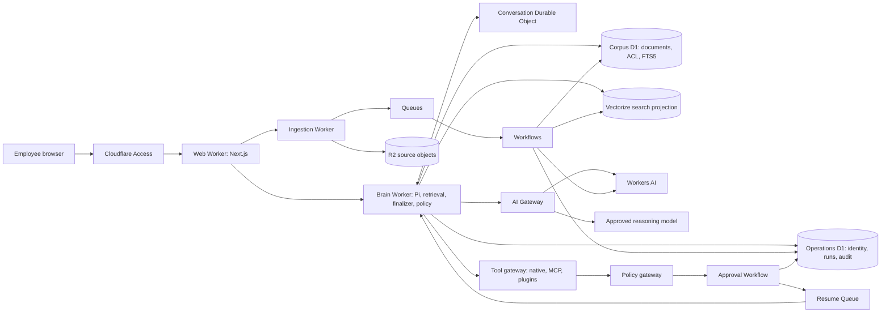

# Useful Brain production master plan

Status: finalized and approved for phased implementation, version 1.3

Date: 2026-08-26

Implementation status: approved. Phase 0 is merged ([PR #10](https://github.com/wasimjalali/useful-brain/pull/10)). Phase 1 local skeleton is in progress. Do not provision Cloudflare resources or run paid inference until Wasim approves.

## 1. Decision

Useful Brain will be a Cloudflare-native company knowledge and action system. Convex and Microsoft Foundry are legacy implementation details and are not part of the target architecture.

Cloudflare will own the application runtime, relational data, object storage, vector search, durable jobs, queues, real-time coordination, identity perimeter, AI routing and operational telemetry. Model inference remains replaceable behind Cloudflare AI Gateway. Workers AI is the default for embeddings and reranking. The main agent model may be Cloudflare-hosted or reached through AI Gateway, but it must clear the same quality, tool-use, latency and cost gates.

The deployment boundary is one application and one isolated resource set per company. This is not a shared multi-tenant database. Each company receives separate corpus and operations D1 databases so indexing load, corpus recovery and live conversations do not share one single-threaded database. That boundary fits D1's horizontal scaling model, limits blast radius and makes company-specific identity, retention and connector policy easier to enforce.

### Why Cloudflare is the right choice

- The Burooj Sanad implementation already proves the important D1, FTS5, Vectorize, Workers AI and Cloudflare Access path.
- Useful Brain is read-heavy. D1 is suitable when each company has isolated databases, queries are indexed and historical event data is archived before either database reaches the 10 GB ceiling.
- R2, Vectorize, Queues, Workflows and Durable Objects cover the distinct storage and execution shapes instead of forcing them into one database.
- Cloudflare Access provides a strong company SSO perimeter. D1 remains responsible for application roles, departments and document access rules.
- The Cloudflare credit balance improves runway, but credits are not the architectural reason. The system still needs service boundaries, cost caps and portability seams.

### Important constraints

- [D1 databases are single-threaded and limited to 10 GB each](https://developers.cloudflare.com/d1/platform/limits/). The answer is two databases per company, short indexed transactions, the Sessions API for replicated reads and R2 archival, not one global D1 database.
- [Vectorize mutations are asynchronous](https://developers.cloudflare.com/vectorize/reference/client-api/). D1 is authoritative. Vectorize is a rebuildable search projection with a reconciliation ledger.
- [Vectorize metadata filtering runs before topK selection](https://developers.cloudflare.com/vectorize/reference/metadata-filtering/). ACL metadata indexes must exist before vectors are written.
- [Queues provide at-least-once delivery](https://developers.cloudflare.com/queues/reference/delivery-guarantees/). Cloudflare does not deduplicate deliveries for the application. Queue payloads carry identifiers only and consumers enforce idempotency.
- [Workers have a 128 MB isolate memory limit](https://developers.cloudflare.com/workers/platform/limits/). File parsing and ingestion must stream, batch and reject oversized inputs.
- Cloudflare currently recommends vinext for new Next.js projects, but it remains beta. The existing Next.js 16 application will use the supported [OpenNext adapter](https://developers.cloudflare.com/workers/framework-guides/web-apps/opennext/) first. A vinext migration can be reconsidered after compatibility and stability gates pass.
- Pi declares Node.js 22.19 or newer for its install and build toolchain while its core and provider factories are designed to bundle without Node-only session dependencies. Phase 0 proved unpaid `fauxProvider()` on Workers with `nodejs_compat`. Live AI Gateway and Workers AI remain unapproved. Cloudflare Containers are generally available, but they are not an automatic fallback. Any Container-hosted agent requires a separate latency, cost, operations and residency decision.

## 2. Product definition

Useful Brain is the central place where a company's employees can:

1. Search and ask questions across approved company knowledge.
2. Inspect the exact evidence behind every factual answer.
3. Connect company sources and keep them synchronized.
4. Ask an agent to perform approved work through native tools, MCP servers or plugins.
5. Review every retrieval decision, tool call, approval and outcome.

The first production target is a private B2B deployment for one company. Public signup, billing, a connector marketplace and shared tenant switching are outside the first production release.

### Non-negotiable product contracts

- No factual company claim without a valid citation to evidence the user is allowed to read.
- Missing or weak evidence returns an insufficient-evidence answer.
- Authorization filters run before fusion, reranking, prompt construction and tool execution.
- Retrieved documents are untrusted data, never instructions.
- An agent can read autonomously within policy. External writes require a policy decision and, where required, an explicit human approval.
- Every run is replayable from its model, prompt version, corpus generation, evidence snapshot, tool inputs, tool results and approval record.

## 3. What is retained and what is replaced

### Keep from the current Nura implementation

- Versioned corpus builds with processing, ready, active, failed and archived states.
- Explicit promotion so a failed index build never damages the active corpus.
- Heading-guided paragraph packing at 160 target words and 220 maximum words, currently without overlap.
- Grounded answer validation, visible citations and deterministic refusal behavior.
- Server-owned conversation history and immutable evidence snapshots.
- Persisted evaluation runs and sanitized operation records.
- The current workspace UI, role-named design tokens and visible retrieval inspector.
- Bounded provider retry and idempotent request records.

### Replace in the current implementation

- Convex database and vector search with D1, D1 FTS5, R2 and Vectorize.
- Microsoft Foundry provider code with Workers AI and AI Gateway adapters.
- The current heading-guided, zero-overlap paragraph chunks with the measured Burooj deployment profile described below.
- Vector-only retrieval with ACL-safe hybrid retrieval and cross-encoder reranking.
- Local filesystem uploads with direct R2 uploads and durable ingestion workflows.
- The one-shot answer call with a Pi agent loop that treats retrieval as a first-class tool.
- The current small support-only eval battery with the larger Burooj Northwind corpus and security cases.

### Rewrite from Burooj, do not copy blindly

The following Sanad behavior is valuable and should be ported into TypeScript with Workers bindings:

| Capability | Burooj source to study | Useful Brain destination |
| --- | --- | --- |
| Shipped 300-token chunks, 30-token overlap and character anchors | `../Burooj/sanad/env.example`, `../Burooj/sanad/src/sanad/ingest/chunker.py` | Cloudflare ingestion worker |
| Query/document-aware embeddings | `../Burooj/sanad/src/sanad/ingest/embeddings.py` | Workers AI embedding adapter |
| D1 FTS5 and Vectorize projection behavior | `../Burooj/sanad/src/sanad/store/cloudflare.py` | D1 and Vectorize repositories |
| Exact D1 and Vectorize inventory audit | `../Burooj/sanad/src/sanad/store/audit.py` | Reconciliation workflow and operator view |
| ACL grouping and pre-score filtering | `../Burooj/sanad/src/sanad/permissions/acl.py` | Authorization and retrieval policy |
| Hybrid fusion and local keyword rescoring | `../Burooj/sanad/src/sanad/retrieve/fusion.py`, `keyword_score.py` | Retrieval pipeline |
| Cross-encoder reranking and score floor | `../Burooj/sanad/src/sanad/retrieve/reranker.py` | Workers AI reranker |
| Parent context and conflicting-source handling | `../Burooj/sanad/src/sanad/retrieve/parent.py`, `conflict.py` | Context assembly and answer contract |
| Access JWT verification | `../Burooj/sanad/src/sanad/auth/access_jwt.py` | Cloudflare Access middleware |
| Connector lifecycle and SSRF controls | `../Burooj/sanad/src/sanad/connectors/` | Source connector worker |
| 65-document synthetic corpus and 120 questions | `../Burooj/sanad/src/sanad/evals/corpus/` | TypeScript evaluation fixtures |
| Answer and host grounding contracts | `../Burooj/sanad/tests/test_brain_answer_contract.py`, `../Burooj/tabari/tests/agent/test_brain_grounding.py` | Agent and RAG integration tests |

Do not port the Python/FastAPI shell, the Tabari desktop application, Tabari's unrelated agent framework or direct REST clients that Workers bindings replace.

The preservation target is behavior, not filenames. The TypeScript port must retain these Burooj invariants:

- ACL candidate generation happens over allowed content only. `acl_group` is a length-prefixed, injective canonical form hashed to a fixed 32-character digest. Comma-joined values are forbidden.
- Grant lists are bounded. An over-wide principal raises an explicit `AclTooWide` policy error instead of truncating permissions.
- Private owners must be non-empty strings. D1 owner extraction checks JSON type and fails closed on any other value.
- Query and document embedding instructions remain distinct. Vectorize uses cosine distance only.
- External-content FTS5 uses `INTEGER PRIMARY KEY AUTOINCREMENT`, synchronized insert, update and delete triggers and `ON CONFLICT DO UPDATE`. `INSERT OR REPLACE` is forbidden.
- Vectorize mutation identifiers are opaque. Wait for exact equality on the newest mutation identifier, then audit a paginated ID inventory. Any D1 or Vectorize movement during the audit makes the result partial and blocks promotion.
- GitHub truncated listings fail the sync. Arbitrary HTTP fetching must pin a validated public address through every redirect hop, including IPv4-mapped, NAT64 and Teredo forms, or remain disabled in favor of explicit origin allowlists.
- Stored connector configuration is recursively scrubbed for secrets. It may reference only explicitly allowlisted connector-secret bindings.
- Access verification pins RS256, requires an application token and fails closed on JWKS or directory failure. Roles and departments come from the server-owned directory, not token custom claims.
- The eval loader rejects duplicate keys. The fake-provider CI ratchet and real-stack ratchet remain separate, including the locked and expanded multi-hop slices.
- Host grounding enforces must-retrieve, current-turn evidence-ledger citations, deterministic unavailable and insufficient-evidence responses and no transport-detail leakage.
- Permission, keyword-oracle and window-eviction suites remain release blockers.

Burooj must not be deleted until the portability gate in Section 12 passes.

## 4. Target system architecture

### Runtime services

| Service | Responsibility | Key rule |
| --- | --- | --- |
| Web Worker | Next.js UI, Access assertion intake, request validation and streaming response proxy | Forward the original signed assertion, never a browser-supplied principal |
| Brain Worker | Access re-verification, Pi loop, retrieval, host grounding finalization, tool registry and policy evaluation | Rehydrate every run from durable state and fail closed |
| Ingestion Worker | Upload finalization, connector sync entrypoints and queue consumer | Never perform an unbounded parse in an HTTP request |
| Conversation Durable Object | One active run per conversation, WebSocket event fan-out and cancellation signal | No approval wait or Pi state lives only in memory. Hibernation may erase all in-memory state |
| Workflows | Source sync, parse, chunk, embed, index, audit, generation promotion, approval waits and approved-run resume | Every step has an idempotency key and bounded retry. Approval uses `waitForEvent` |
| Queues | Fan-out identifiers, connector events and retry isolation | Payloads contain IDs only. A deterministic application idempotency key creates or resumes one Workflow instance |
| Tool policy gateway | Authorization, risk classification, approval binding, idempotency and side-effect dispatch | Every tool `execute()` path calls this gateway. Pi hooks are an additional guard, not the control plane |

Service Bindings connect Workers without public HTTP hops, but they do not establish end-user identity. The Brain Worker re-verifies the original Access application assertion before it resolves roles or executes retrieval or tools. Each Worker receives only the bindings and secrets it needs.

## 5. Data architecture

### Authoritative storage

The corpus D1 database is authoritative for:

- sources, connector instances and sync checkpoints
- documents, document versions and access policies
- corpus generations and promotion state
- chunks, source anchors, content digests and FTS5 rows
- vector mutation and reconciliation ledger

The operations D1 database is authoritative for:

- users, roles, departments and verified-subject principal mappings
- conversations, messages and evidence-snapshot metadata
- agent runs, tool calls, approvals and sanitized audit events
- eval definitions, runs and results

R2 is authoritative for raw uploads, normalized source artifacts, parser output too large for D1 and archived operational history. Object keys are immutable and content-addressed where possible.

Vectorize stores only vector IDs, embeddings and indexed metadata needed for filtering. A vector ID maps back to a D1 chunk row. Vectorize never stores the only copy of text or authorization policy.

### D1 and FTS contracts

- Corpus and operations migrations are independent. No request assumes an atomic transaction across the two databases.
- External-content FTS5 keys on an explicit `INTEGER PRIMARY KEY AUTOINCREMENT` chunk row ID. Insert, update and delete triggers keep the index synchronized.
- Chunk upserts use `INSERT ... ON CONFLICT DO UPDATE`. `INSERT OR REPLACE` is forbidden because it can bypass the external-content delete contract.
- Operations read replication uses the Sessions API with bookmarks for sequential consistency. Any replicated corpus read path must adopt the same session discipline before it is enabled.
- Corpus rollback changes the active generation pointer. It never invokes Time Travel.
- D1 Time Travel is whole-database, last-resort disaster recovery only. Each database also receives scheduled, encrypted R2 exports with a tested restore procedure.

### Corpus generation state machine

`draft -> indexing -> reconciling -> ready -> active -> archived`

1. Create an immutable draft generation in D1.
2. Resolve sources to immutable R2 objects and document-version rows.
3. Parse and chunk with stable IDs and content digests.
4. Reuse embeddings only when model, dimensions, instruction, chunk text and normalization version all match.
5. Write staged D1 rows, then enqueue Vectorize upserts in a fixed-width generation namespace with only the fixed-width `acl_group` as indexed metadata. Vector IDs are SHA-256 digests no longer than 64 bytes, map uniquely to chunk IDs in corpus D1 and have a unique database constraint.
6. Record every returned mutation identifier and wait for exact equality on the newest identifier. Mutation identifiers are opaque and are never compared with ordering operators.
7. Enumerate the complete paginated Vectorize ID snapshot and compare it with the complete D1 vector ledger. `vectorCount` is diagnostic only, never exact inventory.
8. Mark the generation ready only when counts, IDs, dimensions and metadata indexes match.
9. Promote by changing the active generation pointer in one D1 transaction.
10. Retain the previous generation for rollback, then archive and delete projections through a separate workflow.

Every Vectorize query requires both the active-generation namespace and an `acl_group` metadata filter. Omitting either is an error. A partially indexed generation is never visible. If the D1 ledger or Vectorize mutation watermark changes during an audit, the result is partial and promotion is refused.

### Capacity plan

- One corpus D1 database, one operations D1 database, one R2 prefix and one Vectorize index per company deployment.
- Keep active operational rows in the operations database. Archive old run events, evidence bodies and full parser artifacts to R2 on a retention schedule.
- Use short, indexed D1 queries. Never scan large tables from the request path.
- Enable D1 read replication only with the Sessions API. Writes still go to the primary.
- Alert before either D1 database reaches 60 percent of its size limit and before queue or workflow backlogs breach the service budget.

## 6. Production RAG design

### Ingestion

- Direct browser uploads use short-lived signed R2 URLs. The web Worker never buffers the full file.
- Initial formats are Markdown, text, HTML and bounded PDFs. Unsupported or oversized formats fail with a clear operator error.
- Queue messages contain immutable job, source or batch identifiers only and stay far below the 128 KB platform limit. The consumer derives a deterministic Workflow instance ID from the idempotency key.
- Connector sync uses immutable source versions, stable checkpoints and delete detection. A source is eligible for stale-document deletion only after a complete successful list and ingest.
- The first connectors are GitHub repositories and public or allowlisted HTTP Markdown. Google Drive, SharePoint, Notion and Slack follow through connector adapters after their auth and rate-limit contracts are designed.
- GitHub sync refuses a `truncated: true` tree response. It never interprets a partial repository listing as source deletion.
- HTTP connectors block userinfo and non-HTTP schemes, resolve only public addresses, pin the validated address for the connection and repeat validation on every redirect. IPv4-mapped IPv6, NAT64, Teredo and configured translation prefixes are checked. If that exact network contract cannot be implemented safely in a Worker, arbitrary HTTP URLs stay disabled and v1 uses operator-owned origin allowlists or a separately approved connector egress service.
- Connector configuration is recursively scrubbed before persistence. Secret values never enter D1. A stored connector may reference only an explicitly allowlisted connector-secret binding.
- Chunking begins with the shipped Burooj profile: 300 estimated tokens, 30-token overlap, heading boundaries, sentence-aware cuts and original character anchors. This fits the reranker's 512-token query-plus-passage window better than the library's 500/50 default. Evals may change these values, but a change creates a new chunking version and corpus generation.

### Retrieval

The starting retrieval profile is inherited from the measured Burooj stack, then ratcheted through Useful Brain evals:

1. Normalize and classify the query without adding unsupported facts.
2. Resolve the principal to allowed ACL groups.
3. Query Vectorize with the active-generation namespace and the required `acl_group` filter.
4. Query D1 FTS5 with the same generation and ACL constraints.
5. Load only allowed candidate rows from D1.
6. Recompute keyword scores over the allowed set before fusion.
7. Fuse dense and keyword channels, starting at 0.70 vector and 0.30 keyword.
8. Rerank the leading 20 candidates with `@cf/baai/bge-reranker-base` after ACL filtering.
9. Apply an eval-calibrated absolute reranker relevance floor.
10. Return up to eight chunks. Parent expansion ships off.

The first embedding candidate is Workers AI `@cf/qwen/qwen3-embedding-0.6b` at 1024 dimensions because Burooj already measured it on the real D1 and Vectorize stack. It remains a measured default, not an irreversible choice. Changing the model or dimension creates a new Vectorize index and corpus generation.

### ACL and trace contract

- Candidate generation in both Vectorize and FTS5 is store-side and fail-closed. A missing `acl_group` metadata index raises an operator error. Creating the index requires re-upserting all existing vectors before queries are allowed.
- The ACL group key uses sorted, length-prefixed values before SHA-256 truncation to 32 hexadecimal characters. The representation must remain injective within the supported ACL model and below Vectorize's 64-byte indexed-string limit.
- A principal with more roles or departments than the bound query can safely carry receives `AclTooWide`. The compact serialized Vectorize filter is also measured before the query and must stay below 2,048 bytes. Grants and allowed ACL groups are never truncated. A future multi-query strategy needs separate security and ranking proof before it can replace refusal.
- Keyword scores are recomputed only over the allowed passage set. Store-global BM25 scores are candidate-generation data and never reach fusion, traces or users.
- User-visible evidence and retrieval traces never include denied chunk IDs, denied scores, candidate-removal counts or character offsets that reveal partial-document layout. Restricted operator diagnostics may include aggregate health data only when the operator is authorized for the corpus.
- Parent expansion remains off until it improves answer quality and passes partial-document tests. If enabled later, every sibling receives its own ACL check before prompt construction.

### Answer contract

- The model receives only the user question, bounded server-owned history, allowed evidence and explicit untrusted-data delimiters.
- Output is structured data with `answerType`, paragraph text and citation IDs.
- Every grounded paragraph has at least one valid citation.
- Citation IDs must resolve to the current evidence snapshot and active corpus generation.
- Conflict detection and conflict UI ship off. Burooj measured 0 percent precision on its current detector. They may be enabled only after a named eval set clears an approved precision floor.
- Missing evidence returns `insufficient_evidence` and never invokes an action tool to compensate.
- The complete evidence snapshot, retrieval trace and prompt version are stored for replay, but raw provider prompts are excluded from general logs.

## 7. Pi agent architecture

Useful Brain will use `@earendil-works/pi-agent-core` and only the required `@earendil-works/pi-ai` provider factory. It will not use the Pi coding-agent CLI and it will not use Cloudflare Agents SDK as a second agent framework.

### Run lifecycle

1. The conversation Durable Object acquires the run lock and opens the event stream.
2. The Brain Worker re-verifies the original Access application assertion, resolves the server-owned principal from the operations database and loads bounded conversation and policy state.
3. It constructs a fresh Pi `Agent` for the run.
4. Pi calls `search_knowledge` for company knowledge. Grounded evidence becomes a typed tool result, not hidden prompt text.
5. `beforeToolCall` performs an early schema and policy check. Every tool's `execute()` path then calls the central policy gateway, which independently validates identity, permissions, rate limits, action risk, approval state and idempotency.
6. Read tools execute when allowed. Every mutating tool declares `executionMode: "sequential"`. A write either executes, creates a durable approval Workflow or fails closed.
7. `afterToolCall` redacts the stored result, records the audit event and decides whether the loop should terminate.
8. A host finalizer validates the assistant response against the current-turn evidence ledger. The model cannot waive or bypass this check.
9. Messages, evidence, tool calls and final state commit to the operations database before the run lock is released.

An approval does not keep Pi or a Durable Object waiter alive. The current Brain run commits a `pending_approval` state and ends. A Workflow waits durably with `waitForEvent`, validates the approval event against the stored record, then enqueues one deterministic resume. The next Brain run reconstructs state and rechecks policy before the side effect.

### Host grounding finalizer

After every knowledge turn, the Brain host enforces all of the following:

- a company-knowledge answer must have called `search_knowledge` during the current turn
- the evidence ledger is built only from successful current-turn search results and keyed by immutable `chunk_id`
- every grounded paragraph cites only chunk IDs present in that ledger
- empty or below-floor evidence deterministically becomes `insufficient_evidence`
- unavailable retrieval becomes one deterministic availability response with no host, port, provider or transport detail
- all search, native-tool, MCP and plugin results are framed as untrusted data before the next model call
- the finalized answer, not the model's unchecked prose, is what is persisted and streamed as complete

### Tool risk policy

| Class | Examples | Default behavior |
| --- | --- | --- |
| Read | search knowledge, inspect ticket, list calendar availability | Execute if the principal has source permission |
| Reversible write | create draft, add comment, prepare email, create unsubmitted task | Require preview. Per-tool policy decides whether approval is needed |
| External communication or state change | send email, post message, update CRM, create calendar event | Explicit human approval before execution |
| High risk | delete records, spend money, change security settings, publish externally | Denied in the first production release |

Approval binds the exact tool name, normalized arguments, principal, conversation, expiry and idempotency key. Editing arguments invalidates the approval. Tool results are treated as untrusted input on the next model turn.

### Pi compatibility gate

Before any migration package is installed, build a throwaway Worker spike that proves:

- the selective Pi imports bundle below the Worker size and startup limits
- Cloudflare AI Gateway streaming and tool calls work
- abort, timeout and disconnect propagation work
- Pi event ordering maps correctly to the Durable Object stream
- no Node-only provider, OAuth or SQLite backend enters the Worker bundle
- state can be reconstructed from D1 without relying on an in-memory Pi session

If this fails, the agent milestone pauses. Knowledge-only RAG may ship first if Wasim approves it. A minimal Pi runtime in a Cloudflare Container is one option, but it requires a separate production-readiness decision and is not selected automatically.

## 8. Identity, authorization and security

- Cloudflare Access protects every production route. The Web Worker uses `ctx.access` when Access directly invokes it and forwards the original `Cf-Access-Jwt-Assertion` to Brain. Brain independently validates the RS256 signature, key ID, issuer, audience, `iat`, `nbf`, expiry and `type=app` before any data access.
- Service-token identity and employee identity occupy explicit, disjoint namespaces. An empty service-token `sub` is never treated as an employee.
- The verified Access subject maps to a principal in the operations database. Roles and departments are server-owned. Browser-supplied claims and trimmed token custom claims never authorize data.
- The three identity modes are mutually exclusive: Access, loopback-only asserted development identity, or disabled. Production and staging fail at startup if asserted identity or Wrangler `access.dev` is configured.
- Document authorization supports public, department, role and private-owner scopes. The resulting ACL group is indexed in Vectorize and expressed independently in D1 SQL.
- Denied chunks never enter candidate normalization, reranking, model context, logs or traces.
- Worker secrets or AI Gateway stored keys hold initial provider and connector service credentials. No secret value is stored in repository files or ordinary D1 rows.
- Per-user OAuth connectors are a later security milestone. Their tokens require envelope encryption, rotation, revocation and least-privilege scopes before release.
- AI Gateway metadata logging remains enabled for operational metrics, but payload collection is disabled at both the gateway and request level with `cf-aig-collect-log-payload: false`. Logs carry IDs, timings, model names, token counts and error codes, not document text.
- Connector parsers enforce MIME, size, decompression and time budgets. Archive bombs and active content are rejected.
- Every mutating API uses an idempotency key. Queue consumers deduplicate in application state because delivery is at least once. No design relies on platform deduplication.
- WAF and rate-limit rules protect upload, search, agent-run and approval endpoints.
- D1 Time Travel is destructive whole-database disaster recovery. Scheduled R2 exports and tested restore procedures are the durable backup plan. Corpus rollback always uses the generation pointer.
- The current unauthenticated Nura mutation actions must be removed or protected before any Cloudflare deployment can receive non-synthetic data.

## 9. Observability and cost controls

The restricted operator view must expose:

- request and run IDs across web, brain, workflow and queue services
- retrieval channel counts over the allowed set, fusion scores, rerank scores and cited chunks
- model, prompt, embedding, chunking and corpus versions
- queue age, workflow state, retry count, dead-letter count and reconciliation drift
- tool-call risk class, approval latency, execution outcome and idempotency status
- latency percentiles and usage per company, user, model, connector and operation class

Use Workers Logs for structured operational logs, Analytics Engine for high-cardinality product metrics and AI Gateway for model latency, token and error telemetry. Configure CPU and subrequest caps in Wrangler, upload limits, model budgets, connector rate limits and daily usage alerts. Do not enable response caching for private RAG or agent requests by default.

Employee chat and citation inspectors are a different surface from restricted operator diagnostics. They never expose ACL removal counts or any value derived from denied candidates.

## 10. Evaluation strategy and release gates

Port the 65-document Northwind synthetic corpus and all 120 Burooj questions from Sanad commit `630ba08dc7cad6aa71942d6842ce6d8d55a26873`. Preserve the existing distribution of 70 factual, 17 trap, 13 permission, 10 unanswerable, five locked multi-hop and five expanded multi-hop questions. Keep q086-q090 and q116-q120 as separate named slices. Keep the current Nura cases that cover citation formatting, refusal and prompt injection. Add agent tool-policy cases before action tools ship.

The 120 inherited questions are a locked migration baseline, not a train/holdout pool. New tuning uses newly authored documents and questions. Permission and unanswerable cases are abstention suites. Local eval commands must run against an isolated eval corpus and must never ingest or rewrite the active production corpus.

### Required suites

- chunk boundary, anchor and stable-ID tests
- D1 FTS and Vectorize contract tests
- D1 and Vectorize inventory reconciliation tests
- FTS external-content trigger, stable row ID and forbidden `INSERT OR REPLACE` tests
- factual, close-document, exact-token, multi-hop and conflicting-version retrieval
- public, department, role and private-owner ACL tests
- permission side-channel tests for group-key collisions, keyword oracles, window eviction and user-trace hygiene
- unanswerable, prompt-injection and deleted-source cases
- citation validity and evidence-snapshot replay
- queue duplicate, partial failure and workflow resume tests
- Pi event, cancellation, turn-limit and tool-error tests
- Pi host-finalizer, must-retrieve, evidence-ledger and sequential-mutating-tool tests
- tool approval, argument-tampering, idempotency and audit tests
- Brain identity tests that reject an unsigned or unverified principal passed through a Service Binding
- GitHub truncated-tree, connector-secret scrub and HTTP redirect-address validation tests
- load tests for concurrent chat, indexing and connector sync
- restore drills for both D1 databases and R2, proving corpus rollback does not use Time Travel

### Ship blockers

- zero unauthorized chunks, citations or tool results in all ACL tests
- zero invalid citation IDs
- zero unsupported answers in the locked unanswerable set
- zero high or critical findings in auth, ACL, data access, connector or tool execution code
- no retrieval regression against the locked Burooj baseline without an approved explanation
- every Vectorize generation passes exact inventory reconciliation before promotion
- all duplicate queue deliveries and retried workflow steps are idempotent
- AI Gateway payload collection is disabled by configuration and asserted on every production model request
- mutating Pi tools are sequential and every side effect passes through the policy gateway
- p95 latency, quality and cost budgets are measured on the selected production model and recorded before launch
- the complete TypeScript, lint, test and production-build suite passes

Two quality ratchets are required: deterministic fake-provider CI floors and real Cloudflare-stack floors. The real baseline records source commit, 300/30 chunking, 0.70/0.30 fusion, six keyword candidates, 20 rerank candidates, BGE reranking and the 0.05 starting floor. Wait for Vectorize reconciliation before measuring it. A change cannot lower either locked metric silently.

## 11. Delivery plan

### Phase 0: review, rebrand and feasibility

- Complete the Useful Brain product, repository and local-directory rename.
- Keep historical Nura design documents as historical records.
- Run the external critical review prompt in `docs/useful-brain-critical-review-prompt.md`.
- Incorporate accepted gaps into this plan.
- Prove Pi Worker compatibility and Next.js OpenNext compatibility in throwaway spikes.
- Record baseline results from both current Nura and Burooj Sanad, including the exact Sanad commit and retrieval fingerprint.
- Record the first company's residency, corpus-size, reindex-cadence, p95 latency, quality and monthly-cost budgets.

Architecture approval is complete. Phase 0 is merged. Phase 1 adds the local Worker skeleton and identity contracts. Do not provision Cloudflare resources or run paid inference until Wasim approves.

### First-pilot planning profile

These are planning assumptions for the first isolated company deployment, not customer contractual promises. They were approved on 2026-08-26.

#### Residency and retention

- Target an EU-based first pilot.
- The pilot requires GDPR-compatible processing with contractual transfer safeguards. It does not require strict EU-only processing.
- Create D1 databases and R2 buckets with the `eu` jurisdiction.
- Do not onboard a company requiring strict EU-only processing until Vectorize, Workers AI, AI Gateway, Worker execution and outbound model calls have a documented compliant path.
- Source documents remain until deleted by the company. Purge deleted source objects and obsolete parser artifacts within 30 days.
- Retain conversations and exact evidence snapshots for 90 days.
- Retain operational logs for 30 days.
- Retain approval, security and mutating-action audit records for 365 days.
- Disable AI Gateway prompt and response payload storage. Retain metadata-only usage records.
- Continue using synthetic data until a production data-handling review explicitly permits real company content.

#### First-pilot workload envelope

- Up to 10,000 documents
- Up to 10 GB of source files
- Maximum individual file size: 25 MB
- Planning estimate: up to 100,000 chunks
- Incremental connector synchronization: hourly
- Full corpus rebuild: monthly and on retrieval configuration changes

#### Users and concurrency

- Up to 50 employees
- Up to 10 concurrent chat or agent runs
- Up to 5 service-token callers
- One isolated application and Cloudflare resource set per company

#### Initial product scope

- Ship the Pi-based agent shell with the first release.
- The first release is knowledge-first: retrieval, grounded answers, evaluations and read-only tools.
- External mutating connector actions remain disabled until their policy, approval and idempotency phases pass.
- If a production-only Pi problem appears later, knowledge-only RAG may ship while the agent runtime issue is resolved.

#### Diagnostic visibility

- Company administrators and designated operators may see complete retrieval diagnostics.
- Ordinary employees may see citations and evidence they are authorized to read.
- Ordinary employees may not see ACL calculations, hidden candidates, raw policy traces, model prompts or cross-user operational traces.

#### Numeric release budgets

Latency:

- Retrieval p95: no more than 1.5 seconds
- Time to first generated token p95: no more than 3 seconds
- Complete grounded answer p95: no more than 15 seconds, excluding approval waits and external connector latency
- Accepted document searchable p95: no more than 5 minutes for ordinary files

Quality:

- ACL leaks: exactly 0
- Invalid citations: exactly 0
- Unsupported answers for locked unanswerable cases: exactly 0
- Full fake-provider evaluation floors: recall 0.907, MRR 0.821 and nDCG 0.831
- Locked real-stack slices must meet or exceed the recorded BGE plus 0.05 results
- Retrieval changes may not reduce either the fake or real locked baseline without an explicit reviewed decision

Cost:

- Idle deployment: existing $5 Workers Paid account minimum, with effectively $0 incremental idle Cloudflare cost
- First-pilot Cloudflare platform budget: no more than $25 per month
- External generation-model budget: no more than $75 per month
- Initial combined operating budget: no more than $100 per company per month
- Credits are excluded from cost justification until the billing dashboard confirms Developer Platform eligibility
- Add budget alerts before any repeated live-stack evaluation or external model workload

### Phase 1: Cloudflare foundation

- Add Wrangler configuration and separate web, brain and ingestion Worker entrypoints.
- Add development, staging and production environments.
- Add Brain-side Access JWT verification, independent corpus and operations D1 migrations, R2, Vectorize, Queues, Workflows, Durable Objects and Service Bindings.
- Add structured logs, request IDs and safe error contracts.

Exit: authenticated skeleton deploys to staging with least-privilege bindings and smoke tests.

### Phase 2: ingestion and corpus generations

- Port the chunker, source model, R2 upload flow, connector contract and generation state machine.
- Implement Workers AI embeddings, ID-only queue messages, deterministic Workflow IDs, exact mutation waits and paginated inventory audit.
- Add GitHub and HTTP Markdown connectors with SSRF controls.

Exit: a failed build leaves the active generation unchanged and a complete build can promote and roll back.

### Phase 3: ACL-safe hybrid retrieval

- Implement D1 FTS5, generation namespaces, fail-closed ACL filters, local keyword rescoring, fusion and reranking. Keep parent expansion and conflict detection off.
- Port the Northwind corpus and retrieval evals.
- Preserve the inherited named slices and dual ratchets. Create new documents and questions for any tuning and holdout work.

Exit: all ACL blockers pass and retrieval meets or beats the locked baseline.

### Phase 4: grounded answers and conversation migration

- Port the structured answer contract, citation validation, evidence snapshots and server-owned history.
- Port the Tabari host-grounding finalizer and current-turn evidence ledger before agent work begins.
- Add streaming through the conversation Durable Object.
- Shadow current Convex answers without changing user-visible behavior.

Exit: citation, refusal, replay and shadow-parity gates pass.

### Phase 5: Pi knowledge agent

- Integrate Pi with the retrieval tool, host finalizer, turn budgets, cancellation, model routing and durable replay.
- Start with read-only tools.
- Add the central policy gateway, sequential mutating tools, preview and Workflow-based approval records before the first write tool.

Exit: adversarial tool-policy tests pass and every run stores the model, prompt version, corpus generation, evidence snapshot, tool inputs, tool results and approval record required for replay.

### Phase 6: connectors, MCP and plugins

- Add a connector registry with capability, auth, rate-limit and data-classification metadata.
- Add remote MCP clients through the same policy gateway as native tools.
- Add per-connector scopes, revocation, health and audit views.

Exit: one read connector and one approved write connector pass security, untrusted-result, failure and revocation tests. A broad marketplace is not required.

### Phase 7: cutover and retirement

- Run staging load, restore and incident drills.
- Run Cloudflare in shadow, then canary, then primary mode.
- Keep the Convex path read-only during the rollback window.
- Remove legacy code only after data and behavior parity are proved.

Exit: production runs on Cloudflare, rollback has expired successfully and legacy resources are decommissioned deliberately.

## 12. Burooj retirement gate

Do not delete Burooj until all of the following are true:

- the Sanad source commit is recorded in this plan or a migration ledger
- the 65 documents, 120 questions and conflict fixtures exist in Useful Brain
- the named retrieval, ACL, identity, host-grounding, connector, FTS and reconciliation behaviors have TypeScript contract tests
- the new Cloudflare stack meets or beats the locked real-stack baseline
- the D1 and Vectorize inventory audit passes on Useful Brain
- the Useful Brain agent passes the host-grounding and answer-contract cases
- any Burooj-only implementation knowledge worth retaining is documented
- a recoverable repository archive exists
- Wasim confirms deletion after reviewing the migration ledger

## 13. Implementation coordination

Implementation uses one bounded phase at a time with explicit acceptance evidence.

- `Grok 4.6 xhigh`: primary implementation, tests, documentation and phase reports.
- `GPT-5.6 Sol xhigh`: architecture changes, critic adjudication, security-boundary review and final integration review.
- The enabled security and code-review checks remain independent merge gates for critical work.

Grok works from `docs/useful-brain-execution-tracker.md` and the checked-in execution prompt. Every phase lands through a branch and PR. It must stop on architecture drift, a failed phase exit, an approval boundary or a newly discovered high-severity risk. Critical auth, database, connector, secret and tool-execution code receives the required security and code reviews before merge.

## 14. Finalized choices and open validation gates

### Finalized

- Product name: Useful Brain.
- Infrastructure: Cloudflare-native.
- Deployment isolation: one resource set per company.
- Web: existing Next.js application on Cloudflare Workers through OpenNext initially.
- Databases and keyword search: separate corpus and operations D1 databases, with FTS5 in the corpus database.
- Files: R2.
- Vector search: Vectorize as a rebuildable projection.
- Durable ingestion and approval waits: Workflows plus Queues.
- Conversation coordination and streaming: Durable Objects with WebSocket hibernation, limited to run locking, fan-out and cancellation.
- Identity perimeter: Cloudflare Access.
- Embeddings and reranking: Workers AI.
- Model routing and telemetry: AI Gateway.
- Agent framework: Pi Agent Core.
- Development and build toolchain: Node.js 22.19 or newer before Pi is installed. This is not a claim about the Workers runtime.
- Connector and action policy: one shared tool gateway for native tools, MCP and plugins.

### Must be validated before the dependent production phase

- Pi's selective bundle and streaming behavior in the Workers runtime. Phase 0 unpaid `fauxProvider()` spike passed. Live AI Gateway and Workers AI remain unapproved.
- Whether a production-only Pi problem should delay mutating actions or ship knowledge-only RAG. The first release ships the Pi agent shell as knowledge-first with read-only tools. There is no automatic Container fallback.
- OpenNext compatibility with every current Next.js feature used by the app.
- The exact reasoning model that clears the locked quality and tool-use gates.
- D1 query plans and latency on the full Northwind corpus plus production-shaped scale data.
- Upload parser memory behavior under the Worker limit.
- Safe arbitrary-HTTP connector egress with pinned public addresses. Until proved, use explicit origin allowlists only.
- Retention and regional requirements for the first real company deployment. Recorded as the first-pilot planning profile: EU-based GDPR-compatible processing with contractual transfer safeguards, not strict EU-only processing; D1 and R2 `eu` jurisdiction; Vectorize, Workers AI, AI Gateway, Worker execution and outbound model calls still need a documented compliant path before a strict EU-only company is onboarded.
- The first company's corpus size, reindex cadence, employee and service-token callers, trace visibility policy and numeric p95 latency, quality and cost budgets. Recorded as the first-pilot planning profile. Those ceilings are planning assumptions until they are measured on the selected production model.

Most gates determine the safe implementation path inside Cloudflare. A company requiring strict EU-only processing would force a residency redesign. A production-only Pi failure can delay mutating actions or ship knowledge-only RAG while the agent runtime is resolved. Neither silently changes the rest of the Cloudflare-native RAG architecture.

## 15. Current Cloudflare cost envelope

The target stack fits the existing Workers Paid account for development, staging and an idle production deployment. Cloudflare bills the account, not each Worker, so separate web, brain and ingestion Workers do not create separate base subscriptions.

| Product | Current included use relevant to Useful Brain |
| --- | --- |
| Workers Paid | $5 monthly minimum, 10 million requests and 30 million CPU milliseconds per month |
| Workers Builds | 6,000 build minutes per month, then $0.005 per minute |
| D1 | 25 billion rows read, 50 million rows written and 5 GB storage per month |
| R2 Standard | 10 GB-month, 1 million Class A operations, 10 million Class B operations and free egress per month |
| Vectorize | 50 million queried dimensions and 10 million stored dimensions included on Workers Paid |
| Queues | 1 million operations per month |
| Workflows | 500,000 steps and 1 GB stored state per month, with request and CPU use sharing the Workers allowances |
| Durable Objects | 1 million requests and 400,000 GB-seconds per month, plus the included SQLite storage allowance |
| Workers AI | 10,000 Neurons per day, then $0.011 per 1,000 Neurons |
| AI Gateway | Core analytics, caching and rate limiting are free. Workers Paid includes 10 million persistent logs per gateway |
| Cloudflare Access | Free for up to 50 users, without the paid-plan SLA and longer log retention |

With the application deployed but no users, files, queued work, vector queries or model calls, the expected Cloudflare total is the existing $5 monthly Workers Paid minimum. The incremental idle cost of Useful Brain is effectively $0. Domains, external model inference, optional paid Zero Trust seats and any product overage are separate.

The 65-document Burooj migration corpus, 120-question evaluation set and ordinary CI builds fit comfortably inside the storage, vector and build allowances. Repeated full-stack model evals can still create Workers AI or external model charges, so staging receives daily spend limits and alerts before those evals run.

First-pilot operating ceilings, excluding credits: no more than $25 per month Cloudflare platform, $75 per month external generation models, and $100 combined per company per month. Credits are excluded from cost justification until the billing dashboard confirms Developer Platform eligibility. Add budget alerts before any repeated live-stack evaluation or external model workload.

The account's Cloudflare credits are useful runway only if their billing terms apply to the Developer Platform products used here. That eligibility is not yet confirmed.

Current pricing references:

- [Workers and platform storage pricing](https://developers.cloudflare.com/workers/platform/pricing/)
- [Workers Builds limits and pricing](https://developers.cloudflare.com/workers/ci-cd/builds/limits-and-pricing/)
- [R2 pricing](https://developers.cloudflare.com/r2/pricing/)
- [Vectorize pricing](https://developers.cloudflare.com/vectorize/platform/pricing/)
- [Queues pricing](https://developers.cloudflare.com/queues/platform/pricing/)
- [Workflows pricing](https://developers.cloudflare.com/workflows/reference/pricing/)
- [Durable Objects pricing](https://developers.cloudflare.com/durable-objects/platform/pricing/)
- [Workers AI pricing](https://developers.cloudflare.com/workers-ai/platform/pricing/)
- [AI Gateway pricing](https://developers.cloudflare.com/ai-gateway/reference/pricing/)
- [Cloudflare Zero Trust plans](https://www.cloudflare.com/plans/zero-trust-services/)
