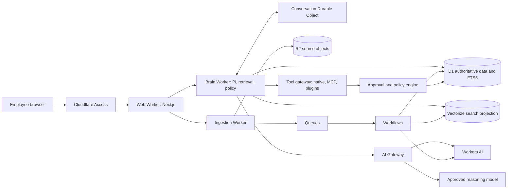

# Useful Brain production master plan

Status: architecture review candidate, version 1.0

Date: 2026-08-26

Implementation status: blocked until the external critical review is returned and every accepted high-severity gap is incorporated here.

## 1. Decision

Useful Brain will be a Cloudflare-native company knowledge and action system. Convex and Microsoft Foundry are legacy implementation details and are not part of the target architecture.

Cloudflare will own the application runtime, relational data, object storage, vector search, durable jobs, queues, real-time coordination, identity perimeter, AI routing and operational telemetry. Model inference remains replaceable behind Cloudflare AI Gateway. Workers AI is the default for embeddings and reranking. The main agent model may be Cloudflare-hosted or reached through AI Gateway, but it must clear the same quality, tool-use, latency and cost gates.

The deployment boundary is one application and one resource set per company. This is not a shared multi-tenant database. That boundary fits D1's horizontal scaling model, limits blast radius and makes company-specific identity, retention and connector policy easier to enforce.

### Why Cloudflare is the right choice

- The Burooj Sanad implementation already proves the important D1, FTS5, Vectorize, Workers AI and Cloudflare Access path.
- Useful Brain is read-heavy. D1 is suitable when each company has its own database, queries are indexed and historical event data is archived before the 10 GB database ceiling becomes a problem.
- R2, Vectorize, Queues, Workflows and Durable Objects cover the distinct storage and execution shapes instead of forcing them into one database.
- Cloudflare Access provides a strong company SSO perimeter. D1 remains responsible for application roles, departments and document access rules.
- The Cloudflare credit balance improves runway, but credits are not the architectural reason. The system still needs service boundaries, cost caps and portability seams.

### Important constraints

- [D1 databases are single-threaded and limited to 10 GB each](https://developers.cloudflare.com/d1/platform/limits/). The answer is database-per-company, short indexed transactions and R2 archival, not one global D1 database.
- [Vectorize mutations are asynchronous](https://developers.cloudflare.com/vectorize/reference/client-api/). D1 is authoritative. Vectorize is a rebuildable search projection with a reconciliation ledger.
- [Vectorize metadata filtering runs before topK selection](https://developers.cloudflare.com/vectorize/reference/metadata-filtering/). ACL metadata indexes must exist before vectors are written.
- [Workers have a 128 MB isolate memory limit](https://developers.cloudflare.com/workers/platform/limits/). File parsing and ingestion must stream, batch and reject oversized inputs.
- Cloudflare currently recommends vinext for new Next.js projects, but it remains beta. The existing Next.js 16 application will use the supported [OpenNext adapter](https://developers.cloudflare.com/workers/framework-guides/web-apps/opennext/) first. A vinext migration can be reconsidered after compatibility and stability gates pass.
- Pi declares Node.js 22.19 or newer while its core and provider factories are designed to bundle without Node-only session dependencies. Direct Worker compatibility must be proved in Phase 0. Cloudflare Containers remain a fallback only because Containers are still beta.

## 2. Product definition

Useful Brain is the central place where a company's employees can:

1. Search and ask questions across approved company knowledge.
2. Inspect the exact evidence behind every factual answer.
3. Connect company sources and keep them synchronized.
4. Ask an agent to perform approved work through native tools, MCP servers or plugins.
5. Review every retrieval decision, tool call, approval and outcome.

The first production target is a private B2B deployment for one company. Public signup, billing, a connector marketplace and shared tenant switching are outside the first production release.

### Non-negotiable product contracts

- No factual company claim without a valid citation to evidence the user is allowed to read.
- Missing or weak evidence returns an insufficient-evidence answer.
- Authorization filters run before fusion, reranking, prompt construction and tool execution.
- Retrieved documents are untrusted data, never instructions.
- An agent can read autonomously within policy. External writes require a policy decision and, where required, an explicit human approval.
- Every run is replayable from its model, prompt version, corpus generation, evidence snapshot, tool inputs, tool results and approval record.

## 3. What is retained and what is replaced

### Keep from the current Nura implementation

- Versioned corpus builds with draft, ready, active and archived states.
- Explicit promotion so a failed index build never damages the active corpus.
- Grounded answer validation, visible citations and deterministic refusal behavior.
- Server-owned conversation history and immutable evidence snapshots.
- Persisted evaluation runs and sanitized operation records.
- The current workspace UI, role-named design tokens and visible retrieval inspector.
- Bounded provider retry and idempotent request records.

### Replace in the current implementation

- Convex database and vector search with D1, D1 FTS5, R2 and Vectorize.
- Microsoft Foundry provider code with Workers AI and AI Gateway adapters.
- Heading-only, zero-overlap chunks with token-window chunks that preserve source anchors.
- Vector-only retrieval with ACL-safe hybrid retrieval and cross-encoder reranking.
- Local filesystem uploads with direct R2 uploads and durable ingestion workflows.
- The one-shot answer call with a Pi agent loop that treats retrieval as a first-class tool.
- The current small support-only eval battery with the larger Burooj Northwind corpus and security cases.

### Rewrite from Burooj, do not copy blindly

The following Sanad behavior is valuable and should be ported into TypeScript with Workers bindings:

| Capability | Burooj source to study | Useful Brain destination |
| --- | --- | --- |
| 500-token chunks, 50-token overlap and character anchors | `../Burooj/sanad/src/sanad/ingest/chunker.py` | Cloudflare ingestion worker |
| Query/document-aware embeddings | `../Burooj/sanad/src/sanad/ingest/embeddings.py` | Workers AI embedding adapter |
| D1 FTS5 and Vectorize projection behavior | `../Burooj/sanad/src/sanad/store/cloudflare.py` | D1 and Vectorize repositories |
| Exact D1 and Vectorize inventory audit | `../Burooj/sanad/src/sanad/store/audit.py` | Reconciliation workflow and operator view |
| ACL grouping and pre-score filtering | `../Burooj/sanad/src/sanad/permissions/acl.py` | Authorization and retrieval policy |
| Hybrid fusion and local keyword rescoring | `../Burooj/sanad/src/sanad/retrieve/fusion.py`, `keyword_score.py` | Retrieval pipeline |
| Cross-encoder reranking and score floor | `../Burooj/sanad/src/sanad/retrieve/reranker.py` | Workers AI reranker |
| Parent context and conflicting-source handling | `../Burooj/sanad/src/sanad/retrieve/parent.py`, `conflict.py` | Context assembly and answer contract |
| Access JWT verification | `../Burooj/sanad/src/sanad/auth/access_jwt.py` | Cloudflare Access middleware |
| Connector lifecycle and SSRF controls | `../Burooj/sanad/src/sanad/connectors/` | Source connector worker |
| 65-document synthetic corpus and 120 questions | `../Burooj/sanad/src/sanad/evals/corpus/` | TypeScript evaluation fixtures |
| Answer and host grounding contracts | `../Burooj/sanad/tests/test_brain_answer_contract.py`, `../Burooj/tabari/tests/agent/test_brain_grounding.py` | Agent and RAG integration tests |

Do not port the Python/FastAPI shell, the Tabari desktop application, Tabari's unrelated agent framework or direct REST clients that Workers bindings replace.

Burooj must not be deleted until the portability gate in Section 12 passes.

## 4. Target system architecture

### Runtime services

| Service | Responsibility | Key rule |
| --- | --- | --- |
| Web Worker | Next.js UI, Access assertion intake, request validation and streaming response proxy | No direct provider secrets and no retrieval policy duplication |
| Brain Worker | Pi loop, retrieval, grounding, tool registry and policy evaluation | Rehydrate every run from durable state and fail closed |
| Ingestion Worker | Upload finalization, connector sync entrypoints and queue consumer | Never perform an unbounded parse in an HTTP request |
| Conversation Durable Object | One active run per conversation, WebSocket event fan-out, cancellation and approval waits | Persist durable facts in D1, not only in memory |
| Workflows | Source sync, parse, chunk, embed, index, audit and generation promotion | Every step has an idempotency key and bounded retry |
| Queues | Fan-out chunk batches, connector events and retry isolation | At-least-once delivery means every consumer deduplicates |

Service Bindings connect Workers without public HTTP hops. Each Worker receives only the bindings and secrets it needs.

## 5. Data architecture

### Authoritative storage

D1 is authoritative for:

- users, roles, departments and principal mappings
- sources, connector instances and sync checkpoints
- documents, document versions and access policies
- corpus generations and promotion state
- chunks, source anchors, content digests and FTS5 rows
- vector mutation and reconciliation ledger
- conversations, messages and evidence snapshots
- agent runs, tool calls, approvals and sanitized audit events
- eval definitions, runs and results

R2 is authoritative for raw uploads, normalized source artifacts, parser output too large for D1 and archived operational history. Object keys are immutable and content-addressed where possible.

Vectorize stores only vector IDs, embeddings and indexed metadata needed for filtering. A vector ID maps back to a D1 chunk row. Vectorize never stores the only copy of text or authorization policy.

### Corpus generation state machine

`draft -> indexing -> reconciling -> ready -> active -> archived`

1. Create an immutable draft generation in D1.
2. Resolve sources to immutable R2 objects and document-version rows.
3. Parse and chunk with stable IDs and content digests.
4. Reuse embeddings only when model, dimensions, instruction, chunk text and normalization version all match.
5. Write staged D1 rows, then enqueue Vectorize upserts with generation and ACL metadata.
6. Wait for the processed mutation watermark.
7. Compare the complete D1 vector ledger with the complete Vectorize inventory.
8. Mark the generation ready only when counts, IDs, dimensions and metadata indexes match.
9. Promote by changing the active generation pointer in one D1 transaction.
10. Retain the previous generation for rollback, then archive and delete projections through a separate workflow.

Queries always filter by active generation. A partially indexed generation is never visible.

### Capacity plan

- One D1 database, one R2 prefix and one Vectorize index per company deployment.
- Keep active operational rows in D1. Archive old run events and full parser artifacts to R2 on a retention schedule.
- Use short, indexed D1 queries. Never scan large tables from the request path.
- Enable D1 read replication only after the Sessions API is integrated correctly. Writes still go to the primary.
- Alert before D1 reaches 60 percent of its size limit and before queue or workflow backlogs breach the service budget.

## 6. Production RAG design

### Ingestion

- Direct browser uploads use short-lived signed R2 URLs. The web Worker never buffers the full file.
- Initial formats are Markdown, text, HTML and bounded PDFs. Unsupported or oversized formats fail with a clear operator error.
- Connector sync uses immutable source versions, stable checkpoints and delete detection.
- The first connectors are GitHub repositories and public or allowlisted HTTP Markdown. Google Drive, SharePoint, Notion and Slack follow through connector adapters after their auth and rate-limit contracts are designed.
- HTTP connectors block userinfo, redirects to private networks, non-public DNS results and DNS rebinding. Allowed origins can be restricted per deployment.
- Chunking begins with the Burooj defaults: 500 estimated tokens, 50-token overlap, heading boundaries, sentence-aware cuts and original character anchors. Evals may change these values, but a change creates a new chunking version and corpus generation.

### Retrieval

The starting retrieval profile is inherited from the measured Burooj stack, then ratcheted through Useful Brain evals:

1. Normalize and classify the query without adding unsupported facts.
2. Resolve the principal to allowed ACL groups.
3. Query Vectorize with active-generation and ACL filters.
4. Query D1 FTS5 with the same generation and ACL constraints.
5. Load only allowed candidate rows from D1.
6. Recompute keyword scores over the allowed set before fusion.
7. Fuse dense and keyword channels, starting at 0.70 vector and 0.30 keyword.
8. Rerank the leading 20 candidates with `@cf/baai/bge-reranker-base` after ACL filtering.
9. Apply an eval-calibrated absolute reranker relevance floor.
10. Return up to eight chunks, then expand only the parent context needed to understand those chunks.

The first embedding candidate is Workers AI `@cf/qwen/qwen3-embedding-0.6b` at 1024 dimensions because Burooj already measured it on the real D1 and Vectorize stack. It remains a measured default, not an irreversible choice. Changing the model or dimension creates a new Vectorize index and corpus generation.

### Answer contract

- The model receives only the user question, bounded server-owned history, allowed evidence and explicit untrusted-data delimiters.
- Output is structured data with `answerType`, paragraph text and citation IDs.
- Every grounded paragraph has at least one valid citation.
- Citation IDs must resolve to the current evidence snapshot and active corpus generation.
- Conflicting effective versions are stated separately with their own citations.
- Missing evidence returns `insufficient_evidence` and never invokes an action tool to compensate.
- The complete evidence snapshot, retrieval trace and prompt version are stored for replay, but raw provider prompts are excluded from general logs.

## 7. Pi agent architecture

Useful Brain will use `@earendil-works/pi-agent-core` and only the required `@earendil-works/pi-ai` provider factory. It will not use the Pi coding-agent CLI and it will not use Cloudflare Agents SDK as a second agent framework.

### Run lifecycle

1. The conversation Durable Object acquires the run lock and opens the event stream.
2. The Brain Worker loads the bounded conversation and policy state from D1.
3. It constructs a fresh Pi `Agent` for the run.
4. Pi calls `search_knowledge` for company knowledge. Grounded evidence becomes a typed tool result, not hidden prompt text.
5. `beforeToolCall` validates schema, identity, permissions, rate limits, action risk and approval state.
6. Read tools execute when allowed. Write tools either execute, pause for approval or fail closed.
7. `afterToolCall` redacts the stored result, records the audit event and decides whether the loop should terminate.
8. Messages, evidence, tool calls and final state commit to D1 before the run lock is released.

### Tool risk policy

| Class | Examples | Default behavior |
| --- | --- | --- |
| Read | search knowledge, inspect ticket, list calendar availability | Execute if the principal has source permission |
| Reversible write | create draft, add comment, prepare email, create unsubmitted task | Require preview. Per-tool policy decides whether approval is needed |
| External communication or state change | send email, post message, update CRM, create calendar event | Explicit human approval before execution |
| High risk | delete records, spend money, change security settings, publish externally | Denied in the first production release |

Approval binds the exact tool name, normalized arguments, principal, conversation, expiry and idempotency key. Editing arguments invalidates the approval. Tool results are treated as untrusted input on the next model turn.

### Pi compatibility gate

Before any migration package is installed, build a throwaway Worker spike that proves:

- the selective Pi imports bundle below the Worker size and startup limits
- Cloudflare AI Gateway streaming and tool calls work
- abort, timeout and disconnect propagation work
- Pi event ordering maps correctly to the Durable Object stream
- no Node-only provider, OAuth or SQLite backend enters the Worker bundle
- state can be reconstructed from D1 without relying on an in-memory Pi session

If this fails, the fallback is a minimal Pi runtime in a Cloudflare Container behind a Service Binding. The Container path needs a separate production-readiness decision because the product remains beta.

## 8. Identity, authorization and security

- Cloudflare Access protects every production route. The Worker validates the `Cf-Access-Jwt-Assertion` issuer, audience, signature and expiry.
- The Access subject maps to a D1 principal. Roles and departments are server-owned. Browser-supplied claims never authorize data.
- A loopback-only asserted principal may exist in local development. Production configuration must fail at startup if that escape hatch is enabled.
- Document authorization supports public, department, role and private-owner scopes. The resulting ACL group is indexed in Vectorize and expressed independently in D1 SQL.
- Denied chunks never enter candidate normalization, reranking, model context, logs or traces.
- Worker secrets or AI Gateway stored keys hold initial provider and connector service credentials. No secret value is stored in repository files or ordinary D1 rows.
- Per-user OAuth connectors are a later security milestone. Their tokens require envelope encryption, rotation, revocation and least-privilege scopes before release.
- Model and AI Gateway payload logging is disabled or minimized for confidential data. Logs carry IDs, timings, model names, token counts and error codes, not document text.
- Connector parsers enforce MIME, size, decompression and time budgets. Archive bombs and active content are rejected.
- Every mutating API uses an idempotency key. Queues use deduplication because delivery is at least once.
- WAF and rate-limit rules protect upload, search, agent-run and approval endpoints.
- D1 Time Travel, immutable backup objects in R2 and tested restore procedures form the recovery plan.

## 9. Observability and cost controls

The operator view must expose:

- request and run IDs across web, brain, workflow and queue services
- retrieval channel counts, ACL removals, fusion scores, rerank scores and cited chunks
- model, prompt, embedding, chunking and corpus versions
- queue age, workflow state, retry count, dead-letter count and reconciliation drift
- tool-call risk class, approval latency, execution outcome and idempotency status
- latency percentiles and usage per company, user, model, connector and operation class

Use Workers Logs for structured operational logs, Analytics Engine for high-cardinality product metrics and AI Gateway for model latency, token and error telemetry. Configure CPU and subrequest caps in Wrangler, upload limits, model budgets, connector rate limits and daily usage alerts. Do not enable response caching for private RAG or agent requests by default.

## 10. Evaluation strategy and release gates

Port the 65-document Northwind synthetic corpus and all 120 Burooj questions. Keep the current Nura cases that cover citation formatting, refusal and prompt injection. Add agent tool-policy cases before action tools ship.

### Required suites

- chunk boundary, anchor and stable-ID tests
- D1 FTS and Vectorize contract tests
- D1 and Vectorize inventory reconciliation tests
- factual, close-document, exact-token, multi-hop and conflicting-version retrieval
- public, department, role and private-owner ACL tests
- permission side-channel tests that compare scores and traces
- unanswerable, prompt-injection and deleted-source cases
- citation validity and evidence-snapshot replay
- queue duplicate, partial failure and workflow resume tests
- Pi event, cancellation, turn-limit and tool-error tests
- tool approval, argument-tampering, idempotency and audit tests
- load tests for concurrent chat, indexing and connector sync
- restore drills for D1 and R2

### Ship blockers

- zero unauthorized chunks, citations or tool results in all ACL tests
- zero invalid citation IDs
- zero unsupported answers in the locked unanswerable set
- zero high or critical findings in auth, ACL, data access, connector or tool execution code
- no retrieval regression against the locked Burooj baseline without an approved explanation
- every Vectorize generation passes exact inventory reconciliation before promotion
- all duplicate queue deliveries and retried workflow steps are idempotent
- p95 latency, quality and cost budgets are measured on the selected production model and recorded before launch
- the complete TypeScript, lint, test and production-build suite passes

Quality metrics become ratchets after the first Cloudflare baseline. A change cannot lower a locked metric silently.

## 11. Delivery plan

### Phase 0: review, rebrand and feasibility

- Complete the Useful Brain product rename in user-facing code and active documentation.
- Keep historical Nura design documents as historical records.
- Run the external critical review prompt in `docs/useful-brain-critical-review-prompt.md`.
- Incorporate accepted gaps into this plan.
- Prove Pi Worker compatibility and Next.js OpenNext compatibility in throwaway spikes.
- Record baseline results from both current Nura and Burooj Sanad.

Exit: revised plan approved, both spikes pass or an explicit fallback is approved. No production migration starts before this exit.

### Phase 1: Cloudflare foundation

- Add Wrangler configuration and separate web, brain and ingestion Worker entrypoints.
- Add development, staging and production environments.
- Add Access JWT verification, D1 migrations, R2, Vectorize, Queues, Workflows, Durable Objects and Service Bindings.
- Add structured logs, request IDs and safe error contracts.

Exit: authenticated skeleton deploys to staging with least-privilege bindings and smoke tests.

### Phase 2: ingestion and corpus generations

- Port the chunker, source model, R2 upload flow, connector contract and generation state machine.
- Implement Workers AI embeddings, batching, mutation watermarks and exact inventory audit.
- Add GitHub and HTTP Markdown connectors with SSRF controls.

Exit: a failed build leaves the active generation unchanged and a complete build can promote and roll back.

### Phase 3: ACL-safe hybrid retrieval

- Implement D1 FTS5, Vectorize filters, local keyword rescoring, fusion, reranking, parent expansion and conflict handling.
- Port the Northwind corpus and retrieval evals.
- Tune only against a training slice, then lock a separate holdout slice.

Exit: all ACL blockers pass and retrieval meets or beats the locked baseline.

### Phase 4: grounded answers and conversation migration

- Port the structured answer contract, citation validation, evidence snapshots and server-owned history.
- Add streaming through the conversation Durable Object.
- Shadow current Convex answers without changing user-visible behavior.

Exit: citation, refusal, replay and shadow-parity gates pass.

### Phase 5: Pi knowledge agent

- Integrate Pi with the retrieval tool, turn budgets, cancellation, model routing and durable replay.
- Start with read-only tools.
- Add the policy engine, preview and approval records before the first write tool.

Exit: adversarial tool-policy tests pass and every run is replayable.

### Phase 6: connectors, MCP and plugins

- Add a connector registry with capability, auth, rate-limit and data-classification metadata.
- Add remote MCP clients through the same policy gateway as native tools.
- Add per-connector scopes, revocation, health and audit views.

Exit: one read connector and one approved write connector pass security, failure and revocation tests. A broad marketplace is not required.

### Phase 7: cutover and retirement

- Run staging load, restore and incident drills.
- Run Cloudflare in shadow, then canary, then primary mode.
- Keep the Convex path read-only during the rollback window.
- Remove legacy code only after data and behavior parity are proved.

Exit: production runs on Cloudflare, rollback has expired successfully and legacy resources are decommissioned deliberately.

## 12. Burooj retirement gate

Do not delete Burooj until all of the following are true:

- the Sanad source commit is recorded in this plan or a migration ledger
- the 65 documents, 120 questions and conflict fixtures exist in Useful Brain
- the named retrieval, ACL, connector and reconciliation behaviors have TypeScript contract tests
- the new Cloudflare stack meets or beats the locked real-stack baseline
- the D1 and Vectorize inventory audit passes on Useful Brain
- the Useful Brain agent passes the host-grounding and answer-contract cases
- any Burooj-only implementation knowledge worth retaining is documented
- a recoverable repository archive exists
- Wasim confirms deletion after reviewing the migration ledger

## 13. Implementation coordination after plan approval

Implementation will use bounded workstreams with explicit file ownership. The primary agent remains responsible for architecture, integration, verification and final decisions.

- `gpt-5.6-sol`: architecture changes, security boundaries, retrieval design, non-trivial debugging and final integration review.
- `gpt-5.6-terra`: day-to-day TypeScript implementation, tests, D1 migrations and UI integration.
- `gpt-5.6-luna`: file discovery, mechanical renames and focused lookup work.

No worker changes the same files concurrently. Every phase lands through a branch and PR. Critical auth, database, connector, secret and tool-execution code receives the required security and code reviews before merge.

## 14. Finalized choices and open validation gates

### Finalized

- Product name: Useful Brain.
- Infrastructure: Cloudflare-native.
- Deployment isolation: one resource set per company.
- Web: existing Next.js application on Cloudflare Workers through OpenNext initially.
- Database and keyword search: D1 and FTS5.
- Files: R2.
- Vector search: Vectorize as a rebuildable projection.
- Durable ingestion: Workflows plus Queues.
- Conversation coordination and streaming: Durable Objects with WebSocket hibernation.
- Identity perimeter: Cloudflare Access.
- Embeddings and reranking: Workers AI.
- Model routing and telemetry: AI Gateway.
- Agent framework: Pi Agent Core.
- Development and build toolchain: Node.js 22.19 or newer before Pi is installed.
- Connector and action policy: one shared tool gateway for native tools, MCP and plugins.

### Must be validated before implementation commits

- Pi's selective bundle and streaming behavior in the Workers runtime.
- OpenNext compatibility with every current Next.js feature used by the app.
- The exact reasoning model that clears the locked quality and tool-use gates.
- D1 query plans and latency on the full Northwind corpus plus production-shaped scale data.
- Upload parser memory behavior under the Worker limit.
- Retention and regional requirements for the first real company deployment.

These gates do not reopen the Cloudflare architecture. They determine the safe implementation path inside it.
